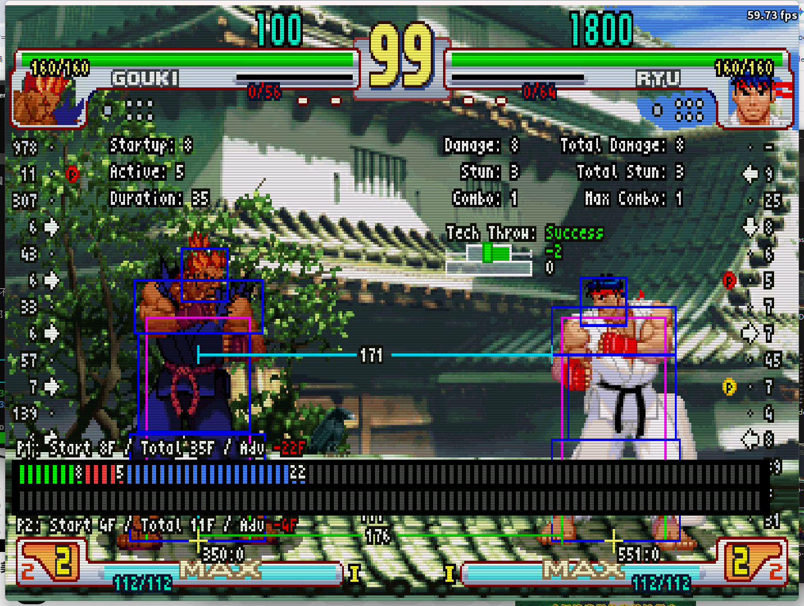
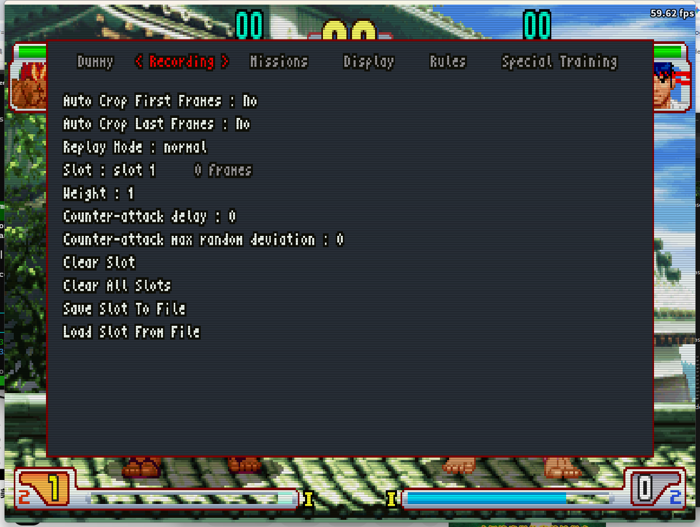
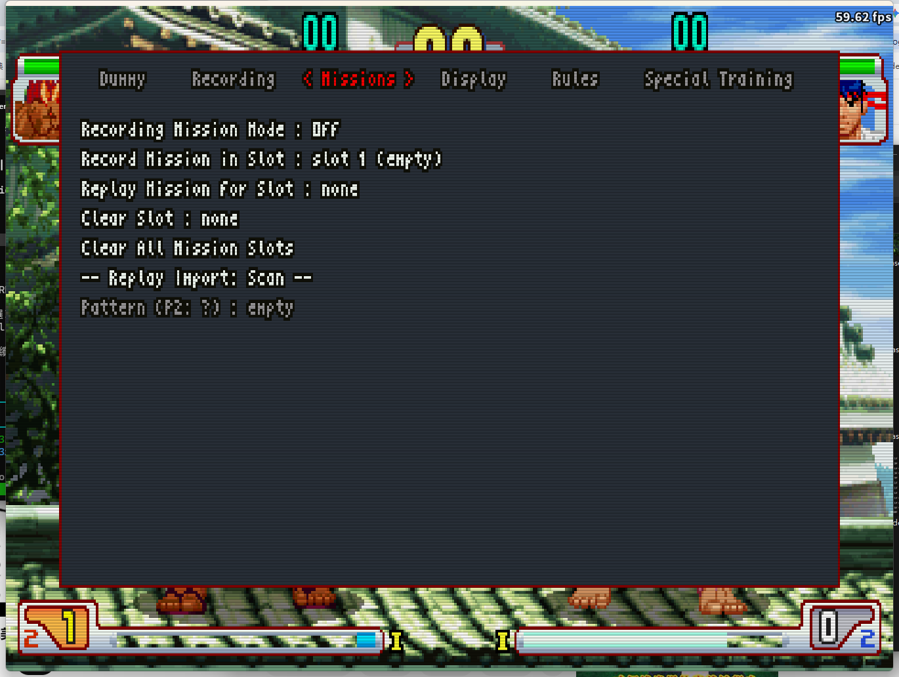
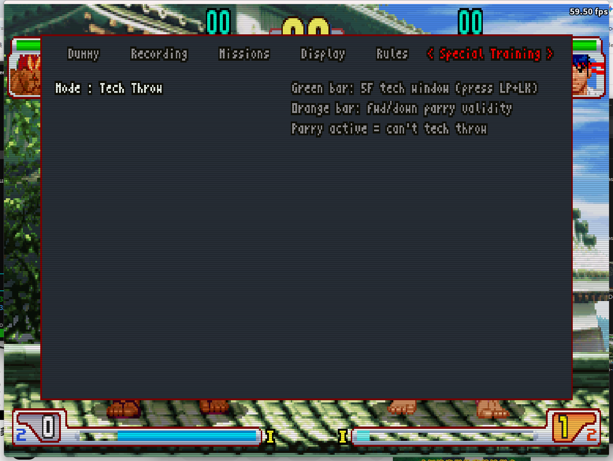
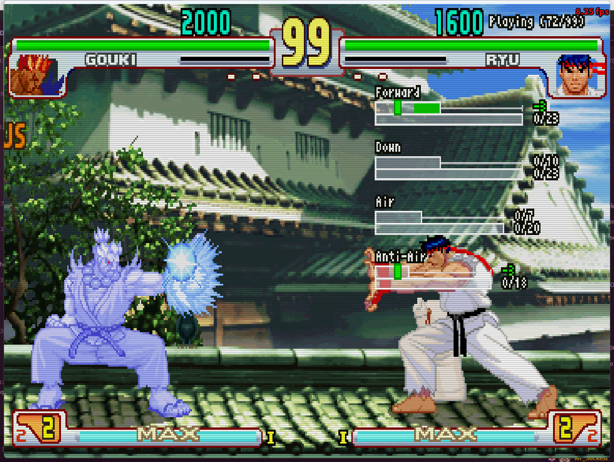
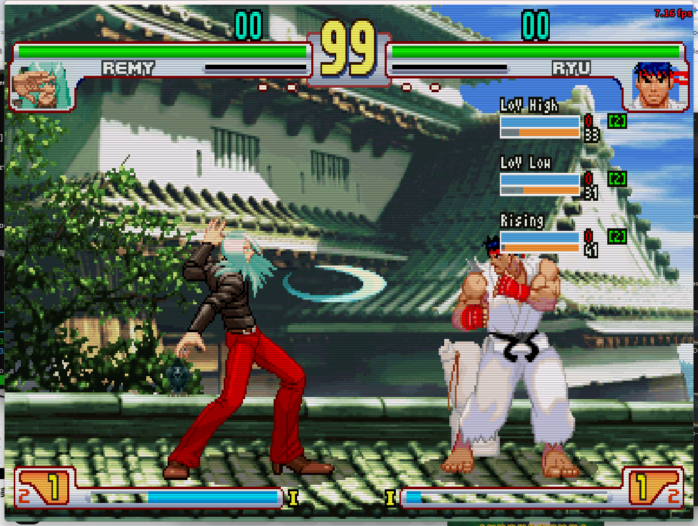
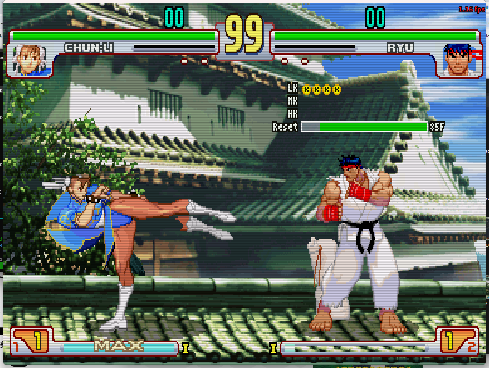
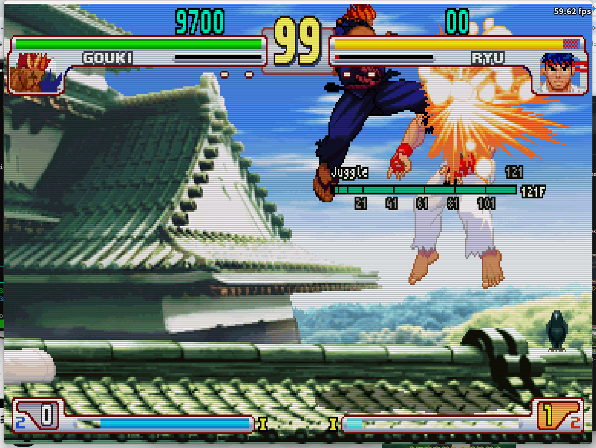
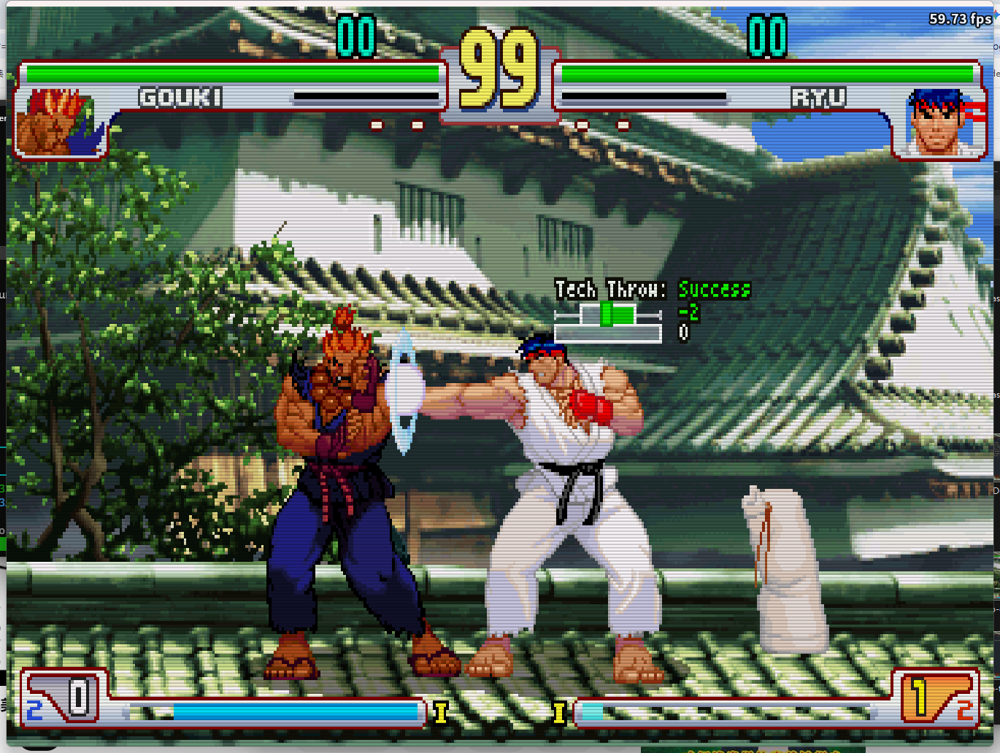
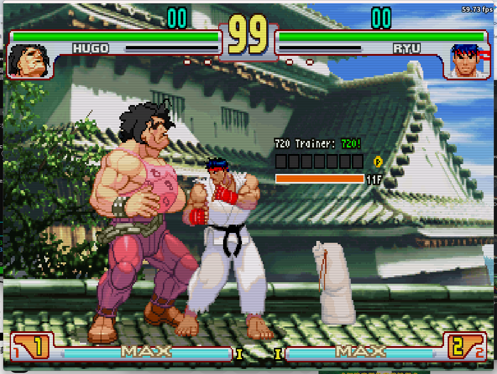

# 3rd_training_lua
Training mode for Street Fighter III 3rd Strike (Japan 990512), on Fightcade v2.0.91

The right version of Fightcade can be downloaded [here](https://www.fightcade.com/)

## Main Features
- Can set dummy to counter-attack with any move on frame 1 after any hit / block / parry / wake-up
- Can record and replay sequences into 8 different slots
- Can replay sequences randomly and as counter-attack
- Can save/load recorded sequences to/from files
- Can display hit/hurt/throwboxes
- Can display input history for both players
- Special training mode to train parries and red parries

---

### Dummy

Configure how the CPU-controlled dummy behaves during training. Set its default stance, blocking style, throw tech responses, and counter-attack options.

| Option | Description |
|--------|-------------|
| Pose | Default stance for the dummy: normal, crouching, jumping, or high jumping. |
| Blocking Style | How the dummy defends: block (normal guard), parry (forward parry), or red parry. Enables "Hits before Red Parry" when set to red parry. |
| Hits before Red Parry | Number of hits received before the dummy performs a red parry. Only active when Blocking Style is set to red parry. |
| Blocking | When the dummy triggers its blocking behavior: never, always, on combo hits only, or randomly. |
| Tech Throws | Whether the dummy attempts to escape throws: never, always, or randomly. |
| Counter-Attack Move | Stick motion the dummy performs when counter-attacking (QCF, QCB, HCF, DPF, jumps, etc.). |
| Counter-Attack Action | Button the dummy presses for its counter-attack. Set to "recording" to replay a recorded slot instead. |
| Fast Wake Up | Whether the dummy quick-rises after a knockdown: never, always, or randomly. |

---

### Recording

Record and manage input sequences across up to 8 slots. Control playback order, timing, and save/load sequences to files.

| Option | Description |
|--------|-------------|
| Auto Crop First Frames | Automatically remove leading empty frames (no input) when recording ends. |
| Auto Crop Last Frames | Automatically remove trailing empty frames when recording ends. |
| Replay Mode | Order in which multiple slots are played back: normal (current slot only), random, ordered (sequential), or repeat variants that loop each slot before moving to the next. |
| Slot | Currently active slot for recording and playback (slots 1–8). |
| Weight | Probability weight for this slot in random replay mode — higher values mean it is selected more often (0–100). |
| Counter-attack delay | Frame offset for the counter-attack trigger. Negative values fire earlier, positive values fire later (range: −40 to 40). |
| Counter-attack max random deviation | Maximum random frame deviation applied to the counter-attack trigger timing (range: −600 to 600). |
| Clear slot | Erase all recorded data in the currently selected slot. |
| Clear all slots | Erase recorded data in all 8 slots at once. |
| Save slot to file | Save the current slot's recording to a file (opens a save dialog). |
| Load slot from file | Load a recording from a file into the current slot (opens a load dialog). |

---

### Missions

Record and replay multi-step training scenarios (missions) across up to 10 dedicated slots. Also provides pattern import for replaying AI-analyzed combo patterns against the dummy.

| Option | Description |
|--------|-------------|
| Recording Mission Mode | Enable mission record mode. While on, the Dummy, Recording, Rules, and Special Training tabs are grayed out. |
| Record Mission in Slot | Choose which mission slot (1–10) to record into. Slot label shows existing content or "empty". |
| Replay Mission for Slot | Choose which recorded mission to replay. Set to none to disable playback; grays out Play Side and Replay Mission. |
| Play Side | Which side the dummy controls during mission replay: 1P or 2P. |
| Replay Mission | Start or stop mission replay (toggle: start / stop). |
| Clear Slot | Select a mission slot and confirm with LP to erase it. A confirmation message appears for 5 frames. |
| Clear All Mission Slots | Erase all 10 mission slots at once. |
| -- Replay Import: Scan -- | Scan the patterns folder for .json pattern files matching the current P2 character. |
| Pattern (P2: ?) | Select a scanned pattern file to use for Pattern Replay. Shows "empty" until a scan finds files. |
| Pattern Replay Mode | Playback order for patterns: normal (selected pattern only), random, ordered, or repeat (loop current pattern). |
| Pattern Replay | Start or stop pattern replay against the dummy (toggle: start / stop). |

---

### Display

Toggle various on-screen overlays to visualize game data in real time.

| Option | Description |
|--------|-------------|
| Display Controllers | Show a controller icon with live button states for both P1 and P2. |
| Display Gauges Numbers | Show numeric values for HP, stun, and Super meter for both players. Also enables the Life Loss Indicator (a red bracket showing lost HP above the health bar). |
| Display P1 Input History | Show a scrolling log of P1's recent inputs. |
| Dynamic P1 Input History | Auto-scroll P1's input log so the most recent input always appears at the top. When enabled, Display P2 Input History is grayed out. |
| Display P2 Input History | Show a scrolling log of P2's recent inputs. Grayed out when Dynamic P1 Input History is on. |
| Display Damage Info | Show numeric damage values for each hit. |
| Display Frame Advantage | Show frame advantage or disadvantage after each hit or block. |
| Display Frame Table | Show the real-time per-frame state timeline for both players (startup / active / recovery / hitstun / parry / invincible). |
| Display Hitboxes | Show attack and hurt boxes with a color legend. |
| Display Distances | Show the distance between P1 and P2. Enables the three distance options below. |
| Mid Distance Height | Y-coordinate reference height used for mid-range distance calculation (0–200, default 10). |
| P1 distance reference point | Distance measurement origin for P1: character origin or hurtbox edge. |
| P2 distance reference point | Distance measurement origin for P2: character origin or hurtbox edge. |

---

#### Display Gauges Numbers

When enabled, shows numeric HP / stun / Super values for both players, plus a **Life Loss Indicator** — a red ㄇ-shaped bracket above the health bar showing how much HP was lost in the current round.

---

#### Display Damage Info

Shows per-hit damage, stun, and combo count in real time. Displays both current-hit values and running totals (Total Damage / Total Stun / Max Combo).

---

#### Display P1 / P2 Input History

Shows a scrolling input log on screen — P1 on the left, P2 on the right. Each row shows a direction and the frame count it was held. Enable **Dynamic P1 Input History** to auto-scroll so the most recent input always appears at the top.

---

#### Display Frame Advantage

After each hit or block, shows the move's **Startup**, **Active**, and **Duration** (total frames) on screen. Use this to quickly read frame data without leaving the game.

---

#### Frame Table

The Frame Table shows a real-time per-frame state bar for both P1 (top) and P2 (bottom). Each colored block represents one game frame. The header line shows **Start / Total / Adv** stats after each move.

| Color | State | Meaning |
|-------|-------|---------|
| 🟩 Green | Startup | Frames before the first hitbox appears |
| 🟥 Red | Active | Frames where the attack hitbox is active |
| 🟫 Brown | Projectile | Frames where a projectile hitbox is active |
| 🟦 Blue | Recovery | Frames after the active window until the character can act |
| 🟨 Yellow | Hitstun / Blockstun | Frames the defender cannot act after being hit or blocking |
| 🟪 Purple | Parry | Frames where a parry succeeded |
| ⬜ White | Invincible | Frames where the character has no vulnerability box |
| ⬛ Dark grey | Neutral | Idle / no action |

---

#### Display Hitboxes

| Color | Box type |
|-------|----------|
| 🟥 Red | Attack box (hitbox) |
| 🟦 Blue | Vulnerability box (hurtbox) |
| 🟩 Green | Extended vulnerability box |
| 🟨 Yellow | Throw box |
| 🟧 Orange | Throwable box (can be grabbed) |
| ⬜ White | Push box |

---

#### Display Distances

Shows real-time distance measurements between P1 and P2 as horizontal lines on screen. Three measurements are displayed: ground distance (at feet), mid-body distance (configurable height), and a second reference line. Configure the height and reference point (character origin or hurtbox edge) for each player.

---

### Rules

Adjust match conditions to suit your training goals — time, health recovery, stun behavior, meter, and miscellaneous options.

| Option | Description |
|--------|-------------|
| Select Characters | Go to the character select screen to change characters. Only supported on the sfiii3nr1 ROM; not available on 4rd Strike. |
| Infinite Time | Prevent the round timer from counting down. |
| Life Refill Mode | HP recovery behavior: no refill (none), refill (recover to full after a delay), or infinite (never lose HP). |
| Life refill delay | Frames to wait after taking damage before HP starts recovering. Active when Life Refill Mode is set to refill (1–100, default 20). |
| Stun Mode | Stun bar behavior: normal, no stun (stun never builds), or delayed reset (stun resets to a set value after a delay). |
| P1 Stun reset value | Stun value P1 resets to after the delay. Active when Stun Mode is set to delayed reset (0–64). |
| P2 Stun reset value | Stun value P2 resets to after the delay. Active when Stun Mode is set to delayed reset (0–64). |
| Stun reset delay | Frames to wait after taking a hit before stun resets. Active when Stun Mode is set to delayed reset (1–100, default 20). |
| Meter Refill Mode | Super meter refill behavior: no refill, refill (recover to a set amount after a delay), or infinite. |
| P1 Meter | Target Super meter level for P1 when Meter Refill Mode is set to refill. |
| P2 Meter | Target Super meter level for P2 when Meter Refill Mode is set to refill. |
| Meter refill delay | Frames to wait before the Super meter refills. Active when Meter Refill Mode is set to refill (1–100, default 20). |
| Infinite Super Art Time | Super Art gauge does not drain after activation — the effect lasts indefinitely. |
| Music Volume | Background music volume (0–10, default 10). |
| Speed Up Game Intro | Skip or accelerate the game intro animation to reduce wait time. |

---

### Special Training

Focused training tools for specific SF3 mechanics. Select a mode from **Special Training → Mode** and close the menu to activate.

| Option | Description |
|--------|-------------|
| Mode | Training mode: None / Parry / Charge / Hyakuretsu Kyaku / Juggle / Tech Throw / 720 |
| Follow Character | Gauge follows P1's on-screen position. Grayed out in None, Juggle, Tech Throw, and 720 modes. |

---

#### Parry Mode

Shows real-time timing gauges for all four parry types. Each gauge has two bars:
- **Blue bar** — validity window (the frame window where a parry input is accepted)
- **Orange bar** — cooldown window (frames before the next parry can be attempted)
- **Green number** — delta: how many frames early (positive) or late (negative) the parry input was

| Option | Description |
|--------|-------------|
| Forward Parry Helper | Show timing gauge for forward parry. |
| Down Parry Helper | Show timing gauge for down parry. |
| Air Parry Helper | Show timing gauge for air parry. |
| Anti-Air Parry Helper | Show timing gauge for anti-air parry. |
| Follow Character | Gauge follows P1's on-screen position. |

---

#### Charge Mode

Shows charge timers for held-input special moves (e.g. Remy's LoV, Urien's Headbutt). Each gauge fills as you hold the required direction. The number on the right shows remaining frames to complete the charge.

| Option | Description |
|--------|-------------|
| Display Overcharge | Highlight when charge exceeds the minimum required (overcharge indicator). |
| Follow Character | Gauge follows P1's on-screen position. |

---

#### Hyakuretsu Kyaku Mode (Chun-Li only)

Tracks rapid kick button presses for Chun-Li's Hyakuretsu Kyaku. Shows input count for LK / MK / HK and a reset timer bar. The reset timer shows how long until the kick count resets if no button is pressed.

---

#### Juggle Mode

Displays the dummy's remaining **air hitstun** (juggle frames) as a gauge with tick marks. Each tick corresponds to a juggle decay threshold — once the gauge drops past a tick, the next hit may not connect. Use this to find the optimal timing and limit for air combos.

---

#### Tech Throw Mode

Shows a timing gauge when you are grabbed. Input **LP+LK** within the green window to tech (escape) the throw.

- **Green bar** — 5-frame tech window (input LP+LK here)
- **Orange bar** — Fwd/down parry validity (parry active = cannot tech throw)
- **Delta marker** — shows how many frames early or late your LP+LK input was
- **Result text** — Success (green) / Too Early / Too Late / Parry Active (red)

---

#### 720 Mode (Hugo only)

Detects Hugo's 720° rotation input using SF3's 11-frame window. Shows an input display and result feedback.

- **Result text** — 720! (green, success) / Too Late / Wrong Button
- **Orange bar** — 11-frame input window
- **Input squares** — direction inputs captured during the rotation

---

### Frame Table
Real-time per-frame state timeline (startup/active/recovery/hitstun/parry/invincible) for both players

### Guard Jump
The way guard jump works is that there are situations where you are throw invulnerable (cannot be thrown). These situations are after a reset, knockdown and blocking or being hit by an attack. This unthrowable state lasts for 6 frames.  Guard jump should be input to block for this duration, jumping in a direction and then blocking again.

The current implementation of Counter-Attack Move does not work with how guard jump functions and needs to be input for all of these situations.  

This is because it requires pre-buffered frames of input (the assumption of holding block beforehand in this case).  

Because of its current implementation it will only work properly when knocked down. So in the other listed situations such as being reset or your opponent going for a tick throw, the Counter-Attack Move version in the dummy menu will get thrown if timed correctly.

To properly test guard jump in these situations you must use provided replays.

To use these replays go to the recording menu and follow these steps;

1. Pick a slot you wish to load the replay into
2. Navigate to "Load slot from file" and hit Light Punch
3. Use left and right on your lever or keyboard to navigate the files in your recordings folder and find the Guard Jump you wish to use.
4. Make sure the replay slot where this is loaded is active and replay mode is set to normal.
5. Set "Counter Attack - Delay" in the recording menu to -4 (NEGATIVE 4) for each Guard Jump replay used.
6. Navigate to the "Dummy" menu and set "Counter Attack - Move" to none, and "Counter Attack - Action" to recording.

Now every time your opponent is knocked down, is reset, blocks or gets hit it will attempt to guard jump in the direction of the replay used.

There are three files provided;
1. Neutral Guard jump
2. Guard Jump Back (most commonly used and is what Guard Jump in the Dummy menu currently uses)
3. Guard Jump Forward (To get out of the corner or just try to jump over you)

Providing these replays prevents headache for users figuring out how to properly generate these replays and make them function in any given situation where it is applicable.

Hopefully these replays helps users practice against this technique while the "Counter Attack" functionality is being re-written.  These replays won't be required forever unless you want to use them in some advanced use case.

But for now its best to add this feature so people can know of it's existence and provide replays for advanced players that wish to practice against it in non knockdown scenarios.

These replays are also provided for the purpose of randomized reaction or ordered reaction training for advanced users.

If you want randomization between the three replays then simply load each one into a different replay slot and use the "Random" replay mode with no other replay slots populated.

One such advanced use case example would be a Makoto player using the ability use replay weighting to simulate weighted decisions in order to practice post hayate mixups against an opponent that favors specific types of defensive options.

Thank you for your support in this matter and please enjoy!

## How to Use

### Requirements
- **Fightcade v2** — download from [fightcade.com](https://www.fightcade.com/)
- **ROMs** — `sfiii3.zip` (Japan) and `sfiii3a.zip` (USA) are both required. The script targets the `sfiii3nr1` ROM version.

### Installation
1. Download or clone this repository: [Juilin77/3rd_training_lua_peter](https://github.com/Juilin77/3rd_training_lua_peter)
2. Extract the folder anywhere on your computer
3. Launch Fightcade and start a match of Street Fighter III 3rd Strike (you will need controllers mapped for both P1 and P2)
4. In FBNeo, go to **Game → Lua Scripting → New Lua Script Window**
5. Run `3rd_training.lua` from the extracted folder

### Training Menu
- Press **Start** in-game to open or close the training menu
- Navigate tabs with **Left / Right**, scroll options with **Up / Down**
- Change values with **Left / Right**, confirm buttons with **LP**

### Hotkeys
| Hotkey | Action |
|--------|--------|
| Alt+1 | Return to character select screen |
| Alt+5 | Start / stop Mission recording |
| Coin (double-tap) | Enter / exit recording mode |
| Coin (single, in recording mode) | Start / stop recording |
| Coin (single, in normal mode) | Start / stop replay |

## Bug reporting / Contribute
If you want to be informed when a new version come out and/or discuss the current bugs and features, you can join the [Discord server](https://discord.gg/CDXQyFmcSe) of the project.

This training mode is still in development and you may encounter bugs or missing features while using it. Please report any bug on the **#bugs** channel, and any feature request on the **#features** channel of the discord server.

If you wish to contribute or give any feedback, feel free to get in touch or submit pull requests.

## Troubleshooting
**Q: Missing rom, zip file not found**

A: Make sure you have the proper roms. You must have at least 2 roms: _sfiii3.zip_ and _sfiii3a.zip_. sfiii3 is the japanese version and the zip contains _sfiii3_japan_nocd.29f400.u2_. sfiiia is the american version and contains _sfiii3_usa.29f400.u2_.

You may need to rename zip files so they match exactly what the emulator expect for.

**Q: When I run the script, the characters can no longer move**

A: You are probably using the script on FBA-RR which is not supported anymore, in order to benefit from the last features and improvement you must run the script on Fightcade2's FBNeo emulator. However if you still want to use FBA-RR, you can go back to v0.6 which was the last version supported on FBA-RR.

**Q: Emulator crash when I run lua script**

A: Check video settings, you musn't use "Enhanced" blitter option.

**Q: UI looks weird and hitboxes are misplaced**

A: Check video settings, you must use "Basic" blitter option with no scanlines if you want the UI to work properly.

**Q: Emulator doesn't run at all, there's a missing dll**

A: Install prerequires from [here](https://github.com/TASVideos/BizHawk-Prereqs/releases/latest/)

## Roadmap
[Trello board](https://trello.com/b/UQ8ey2rQ/3rdtraining)

## Changelog
### v0.21 (20/06/2026)
- [Improvement] Capitalized on-screen labels in Display Damage Info (Damage/Stun/Combo etc.) and Display Frame Advantage (Startup/Hit Frame/Advantage etc.) popups (contribution of @Juilin77)
- [Improvement] Frame Table cancel detection: when a move cancel is detected (active resumes after recovery with animation change), recovery frames are relabeled as startup, showing a cleaner green|red | green|red|blue pattern (contribution of @Juilin77)
- [Feature] Frame Table: added "Projectile" state (coffee brown) for projectile moves; fixes all-green bug where fireball recovery was misclassified as startup (contribution of @Juilin77)
- [Fix] Frame Table: throw moves (normal throws, command grabs, multi-hit throws) now correctly show blue recovery frames and calculate Total/Adv using deferred neutral tracking beyond the 90-frame buffer (contribution of @Juilin77)
- [Feature] Added 720 Input Trainer (Special Training → Mode → 720, Hugo only): detects 720° rotation using SF3's 11-frame window (Condition A+B, confirmed from 3s-decomp); shows "720!" on success, "Too Late"/"Wrong Button" on failure with 3-second display (contribution of @Juilin77)

### v0.20 (18/06/2026)
- [Feature] Throw Tech Training (Special Training → Mode → Tech Throw): shows a 5-frame throw tech window after being grabbed, with a delta marker showing when LP+LK was pressed and result feedback — Success (green), Too Late, Too Early, or Parry Active (red) (contribution of @Juilin77)
- [Improvement] Tech Throw gauge extended timeout window to 6F to account for action propagation delay; validity bar freezes at input frame to eliminate off-by-one visual gap (contribution of @Juilin77)
- [Feature] Added Juggle Air Timer (Special Training → Mode → Juggle): gauge displays remaining air hitstun frames for the dummy with tick marks matching SF3 juggle decay values (contribution of @Juilin77)
- [Feature] Added Life Loss Indicator above health bars: when Display Gauges Numbers is enabled and HP is below max, draws a ㄇ-shaped red bracket over the lost HP region with the amount lost in yellow at center, displayed independently for both P1 and P2 (contribution of @Juilin77)
- [Improvement] Standardized all menu labels and on-screen display text to Title Case (contribution of @Juilin77)

### v0.19 (15/06/2026)
- [Feature] Added Frame Table: a real-time per-frame state timeline (startup/active/recovery/hitstun/parry/invincible) for both players with a color legend (contribution of @Juilin77)
- [Improvement] Frame Table capture arms on `has_just_attacked`/`has_just_thrown` to correctly catch invincible startup frames (contribution of @Juilin77)
- [Improvement] Frame Table shows P1/P2 Start/Total/Adv stats independently, resetting on each new capture (contribution of @Juilin77)
- [Improvement] Frame Table blocks enlarged and labeled with per-segment frame durations (contribution of @Juilin77)
- [Fix] Fixed frame count accumulation across capture windows for combos longer than 90 frames (contribution of @Juilin77)
- [Improvement] An attack now arms the opponent's Frame Table in sync, so the defender's capture starts with real neutral pre-roll frames (contribution of @Juilin77)
- [Improvement] Adv value color-coded green/red/yellow, matching `frame_advantage.lua` (contribution of @Juilin77)
- [Improvement] Combos longer than 90 frames keep a dimmed afterimage of the previous capture window (contribution of @Juilin77)
- [Fix] Combo cancels (e.g. 236EXP into 2MP) now correctly split the second hit's startup from the first hit's recovery (contribution of @Juilin77)
- [Fix] Fixed a JSON syntax error in `urien_framedata.json` that broke Urien frame data loading (contribution of @Juilin77)
- [Fix] Reset P1/P2 position before Pattern Replay to fix position drift (contribution of @Juilin77)

### v0.18 (14/06/2026)
- [Feature] Added "Pattern Replay Mode" (normal / random / ordered / repeat) for Replay Import patterns (contribution of @Juilin77)
- [Improvement] Replaced "Direct Play (LP)" button with a "Pattern Replay" start/stop toggle, mirroring Mission Replay (contribution of @Juilin77)
- [Improvement] "Pattern" entry now always shows after scanning (including `empty`), grayed out until a pattern is found; resets to `Pattern (P2: ?) : empty` when the P2 character changes (contribution of @Juilin77)

### v0.17 (11/06/2026)
- [Improvement] Missions tab redesign: "Record Mission in Slot" and "Replay Mission for Slot" now both show `slot N (content / empty)` inline in the menu item itself (contribution of @Juilin77)
- [Improvement] Reordered Play Side above Replay Mission; Replay Mission and Play Side are grayed out when no recording exists in the selected replay slot (contribution of @Juilin77)
- [Feature] Added on-screen frame counter during Mission Replay (top-right HUD) (contribution of @Juilin77)
- [Fix] Corrected `replay_output_path` to point to `replay-pattern-trainer/patterns/` for Direct Play (contribution of @Juilin77)

### v0.16 (17/05/2026)
- [Fix] Replaced os.execute mkdir with .gitkeep — saved/recording_missions/ directory now ships with the repo, eliminating startup freeze (contribution of @Juilin77)

### v0.15 (17/05/2026)
- [Fix] Mission recording slots no longer empty after reloading script — saved/recording_missions/ directory is now created automatically on startup (contribution of @Juilin77)

### v0.14 (10/05/2026)
- [Fix] Mission recording no longer freezes 5-6 seconds on first Alt+5 press (contribution of @Juilin77)
- [Fix] Mission recording frame counter now displays correctly instead of always showing 0 (contribution of @Juilin77)
- [Improvement] Increased mission slots from 5 to 10 (contribution of @Juilin77)

### v0.13 (29/04/2026)
- [Fix] Dummy behavior is now disabled when Mission settings are off (contribution of @Juilin77)
- [Improvement] Follow Character option is grayed out when Special Training is set to none (contribution of @Juilin77)
- [Improvement] Recording frame count is hidden when Mission recording is on (contribution of @Juilin77)
- [Feature] Added independent Clear Slot button (LP to confirm) (contribution of @Juilin77)

### v0.12 (23/04/2026)
- [Feature] Replay Mission ON/OFF toggle in Missions tab — replay starts on menu close, pauses on menu open (contribution of @Juilin77)
- [Feature] Mission recording now captures both P1 and P2 inputs simultaneously; Play Side setting determines which side the dummy replays (contribution of @Juilin77)
- [Feature] Replay Slot list now includes a "None" option; Replay Mission toggle is grayed out when no recording exists in the selected slot (contribution of @Juilin77)
- [Feature] After stopping recording (Alt+5), automatically advances to the next empty Mission Slot to prevent overwriting (contribution of @Juilin77)
- [Improvement] Dummy tab is grayed out when Replay Mission is ON (contribution of @Juilin77)
- [Improvement] FightCade spectator mode: training script no longer interferes with match inputs (contribution of @Juilin77)
- [Fix] Character select: 2P can now be controlled using 1P controls again (contribution of @Juilin77)
- [Fix] Play Side = 2P: player can now move freely during mission replay (contribution of @Juilin77)

### v0.11 (22/04/2026)
- [Feature] Mission recording/replay system (Alt+5 to start/stop recording, auto-replay on menu close) (contribution of @Juilin77)
- [Feature] Mission slots management (clear slot, clear all slots) (contribution of @Juilin77)
- [Improvement] Gray out irrelevant menu tabs when Recording Mission Mode is ON (contribution of @Juilin77)
- [Improvement] Hotkey hints moved from screen overlay to console (contribution of @Juilin77)
- [Improvement] Startup load speed optimized (mission inputs lazy-loaded) (contribution of @Juilin77)

### v0.10 (29/05/2022)
- [Feature] Charge special training (contribution of @ProfessorAnon)
- [Feature] Hyakuretsu Kyaku special training (contribution of @ProfessorAnon)
- [Feature] Dynamic input display (switch sides to avoid overlapping action) (contribution of @ProfessorAnon)
- [Feature] Damage data display (contribution of @sammygutierrez)
- [Feature] New 3rd_spectator.lua script for displaying info during replays without messing with input
- [Feature] Number display for all gauges and bonuses
- [Feature] Frame advantage display
- [Feature] Character switch is now a lot easier:
  - Initial loading puts you right in the character select screen
  - You can go back to the character select screen by hitting alt-1 or from the entry in the training menu
  - Both characters and SA can be selected directly from P1 controller
  - Game intro animation is sped up by default, but this can be disabled in the options
- [Feature] Gill and Shin Gouki can be selected from the character select screen
- [Feature] Added back jump, forward jump, super jump, super forward jump, super back jump counter-attack options
- [Feature] Added auto-crop last frames option
- [Feature] Added guard jump first basic implementation + replays for advanced scenarios (courtesy of @Shodokan)
- [Feature] Added "ordered" and "repeat ordered" replay modes
- [Feature] Blocking system is now working in 4rd Strike (thanks to @speedmccool25 frame data recording)
- [Bugfix] Fixed random parry not behaving properly
- [Bugfix] Fixed self-cancellable LP/LK not correctly blocked on various characters
- [FrameData][Q] added missing back mp + SA2

### v0.9 (04/04/2021)
- [Feature] Projectiles are now blocked/parried
- [Feature] The dummy will now counter-attack on landing after an air recovery
- [Feature] Yun's Genei Jin is now fully blocked/parried by the dummy
- [Feature] Added 4rd Strike rom support in collaboration with @speedmccool25, but no frame data recorded yet.
- [Improvement] When loading a save state, the recording state is reset to a useful state depending on the state you were before
- [Bugfix/Improvement] All characters can now block/parry meaties and all first frame wake up hits
- [Bugfix/Improvement] Fixed a lot of bugs in the overall blocking/parrying/counter-attack system
- [Bugfix/Improvement] Revamped the wake-up / fast wake-up triggering and counter-attack system to be more reliable and maintainable
- [Bugfix] Fixed recordings not loading correctly on US-regioned machines

### v0.8 (23/12/2020)
- [Feature] Special trainings section + parry special training
- [Feature] Stun delayed reset mode
- [Improvement] Added new menu categories and made a better split of options between them
- [Improvement] Changed counter-attack random deviation cap from 40 to 600
- [Bugfix] Fixed incorrect index causing errors when using random replay and weights
- [Bugfix] [issue#21](https://github.com/Grouflon/3rd_training_lua/issues/21) When the game is paused and hitboxes are enabled, an error occurs when loading a savestate
- [Bugfix] [issue#29](https://github.com/Grouflon/3rd_training_lua/issues/29) If you make a recording and rename it with lower case or space in its name, it won't launch
- [Bugfix] [issue#22](https://github.com/Grouflon/3rd_training_lua/issues/22) Input flipping is now decided upon character position diff instead of sprite flip (should fix wrong manipulations occuring after some moves)
- [Bufix] [Fixed meter gauges not updating after loading a save state](https://trello.com/c/7eMUwOHg/76-meter-refill-does-not-update-max-values-correctly-when-coming-back-to-select-screen-or-using-save-states)
- [FrameData] Added some missing Makoto wake up data
- [FrameData] Added some missing Ken wake up data
- [FrameData] Added some missing Ibuki frame data

### v0.7 (12/11/2020)
- Changed main supported emulator from FBA-rr to Fightcade's FBNeo fork
- [Feature] Main player now acts as the training dummy during recording and pre-recording
- [Feature] Added input history display for both players
- [Feature] Added a weight to each replay slot to control randomness (Contribution of @BoredKittenz)
- Redesigned controller display
- [Bugfix] [issue#8](https://github.com/Grouflon/3rd_training_lua/issues/8) Cannot Link moves into super
- [Bugfix] [issue#15](https://github.com/Grouflon/3rd_training_lua/issues/15) Time based super like geneijin not consistent with their meter usage
- [Bugfix] [issue#19](https://github.com/Grouflon/3rd_training_lua/issues/19) Error: Failed to save training settings to training settings.json
- [Bugfix] [issue#18](https://github.com/Grouflon/3rd_training_lua/issues/18) Another Big Issue: Constant Negative Edge While Recording
- [Bugfix] [issue#17](https://github.com/Grouflon/3rd_training_lua/issues/17) Large issue : P2 cannot do EX moves even if they have meter

### v0.6 (04/04/2020)
- Can save/load recorded sequences to/from files
- Keep recordings between sessions (saved per character inside training_settings.json)
- Added counter-attack delay and maximum random deviation to recording slots
- Random blocking mode won't stop blocking in the middle of a true blockstring
- Added First Hit blocking mode
- Added refill delay for life and meter into training settings
- [Bugfix] Fixed dummy bricking when triggering a recording counter attack with nothing recorded
- [Frame Data] Elena
- [Frame Data] Q
- [Frame Data] Ryu
- [Frame Data] Remy
- [Frame Data] Twelve
- [Frame Data] Chun-Li
- [Frame Data] Sean
- [Frame Data] Necro
- [Frame Data] Dudley
- [Frame Data] Yang
- [Frame Data] Yun

### v0.5 (23/03/2020)
- Auto refill life mode
- Auto refill meter mode + ability to set a precise meter amount from the menu
- Infinite Super Art Timer mode
- input autofire (rapid movement when holding key) in menus
- Frame data prediction can resync itself to the actual animation frame, and thus handle a lot more blocking situations
- All 2 hits blocking / parying Fixed
- Blocking / parying of self cancellable moves supported
- Improved wording of some menu elements
- [Bugfix] Fixed infinite meter not working for player 2
- [Bugfix] Fixed recording counterattack triggering in the middle of a blockstring
- [Bugfix] Fixed recording counterattack restarting on hit
- [Frame Data] Oro
- [Frame Data] Ken

### v0.4 (13/02/2020)
- Urien frame data
- Gouki frame data
- Makoto frame data
- Random fast wake up
- Random blocking
- Throws teching
- Added music volume control
- [Bugfix] Fixed Dudley not crouching correctly
- [Bugfix] Fixed Oro not crouching correctly
- [Bugfix] Do not counter attack on state load anymore

### v0.3 (28/01/2020)
- Can now record sequences within 8 different slots
- Can play recorded sequences repeatedly and on random
- Recorded sequences can by triggered as a counter-attack

### v0.2 (26/01/2020)
- New blocking system: Now works by recording hitboxes characteristics to a file for every move and predict hitbox collisions with actual frame data.
- Can switch main player between P1 and P2
- Removed all old frame data
- Entered frame data for Ibuki, Alex and Hugo

### v0.1 (25/11/2019)
- Basic blocking and training options
- Can set dummy to block, parry and red parry after x hits
- Can set dummy to counter-attack with any move after hit, block parry or wake up
- Entered frame data by hand for Ibuki and Urien

## References & Inspirations
- [Wonderful 3S frame data reference](http://baston.esn3s.com/)
- [Hitbox display script by dammit](https://dammit.typepad.com/blog/2011/10/improved-3rd-strike-hitboxes.html)
- [Trials mode script by c_cube](https://ameblo.jp/3fv/entry-12429961069.html)
- [External C# training mode by furitiem](https://www.youtube.com/watch?v=vE27xe0QM64)
- [3S InGame addresses spreadsheet](https://docs.google.com/spreadsheets/d/1eLi9phXMj18QGLfugrHhEQEjIVvSI2zbbUmDgPuLSf0/edit#gid=706955060)
