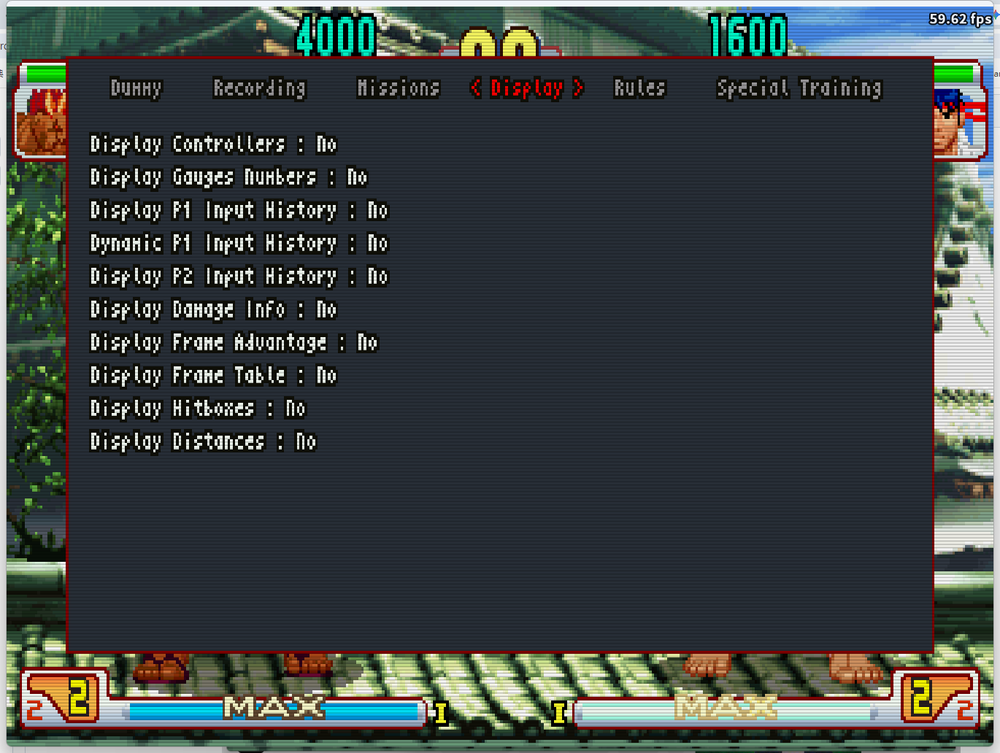
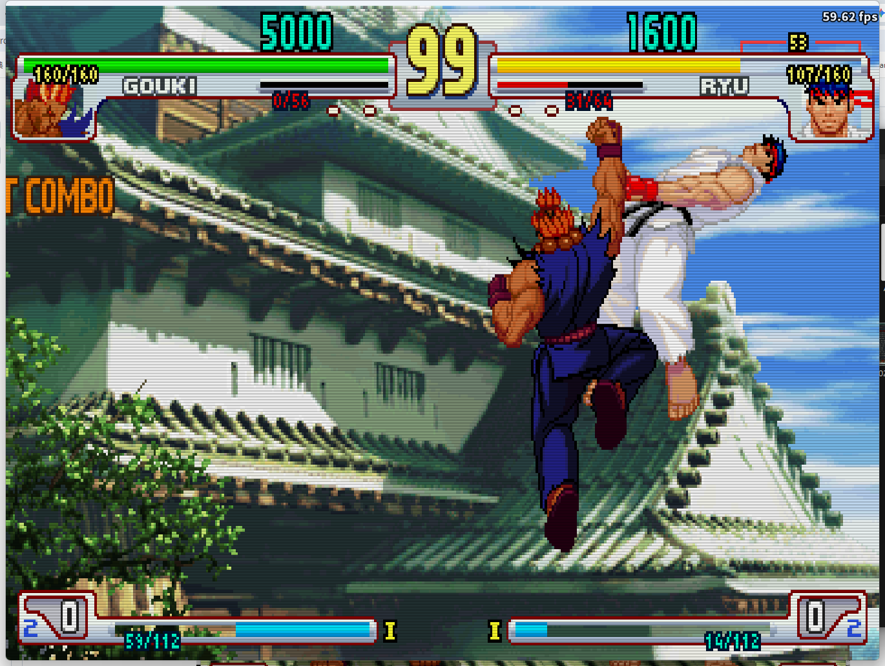
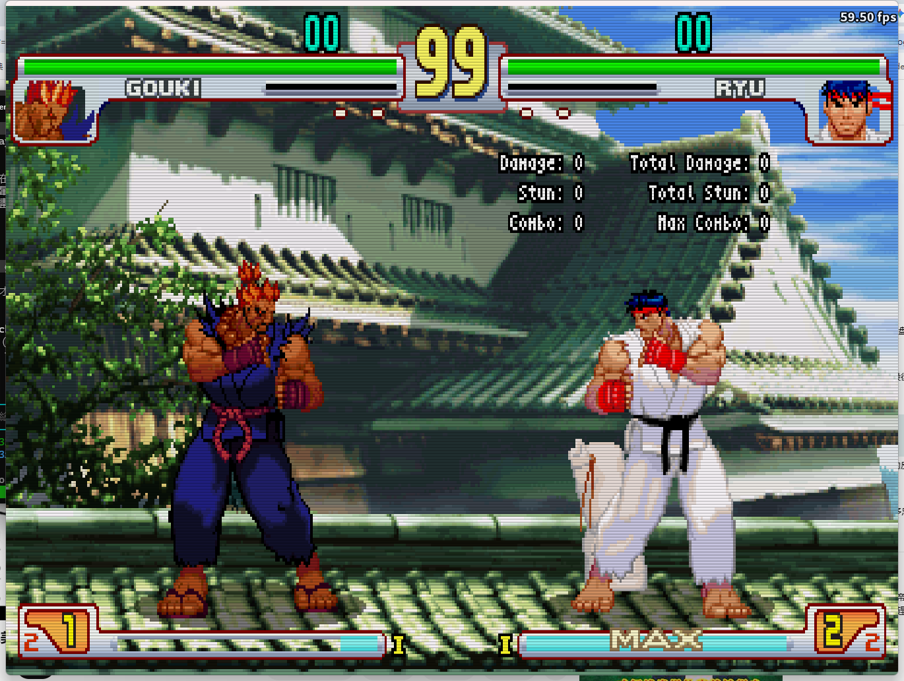
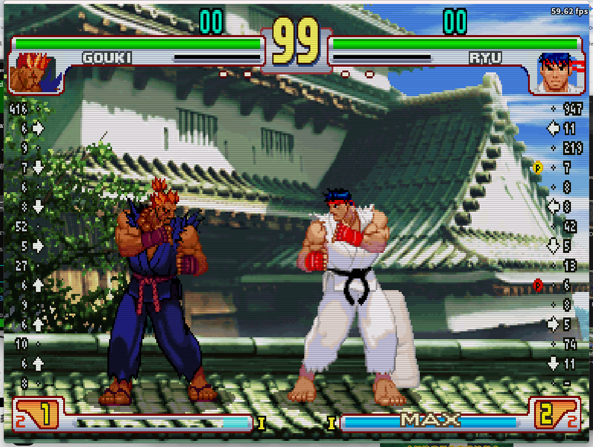
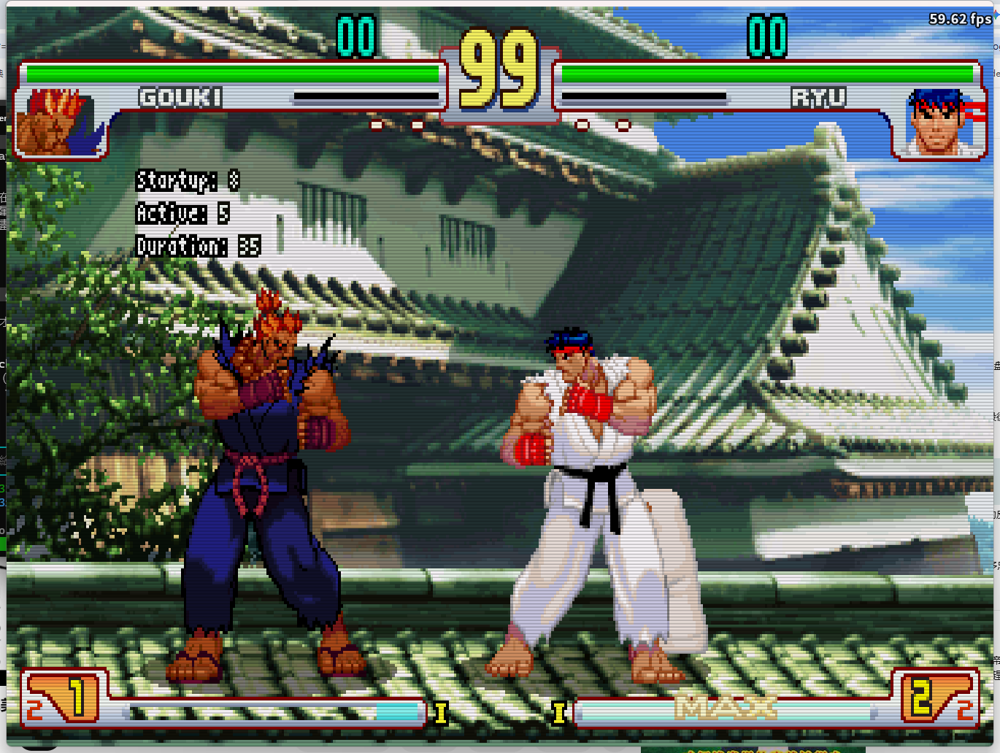
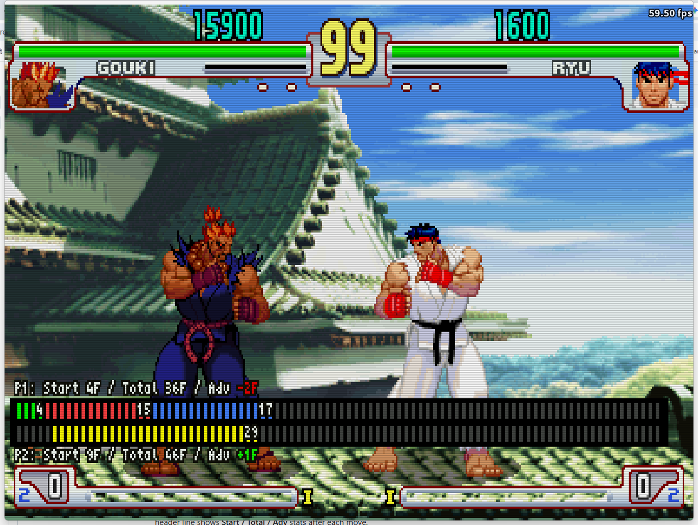
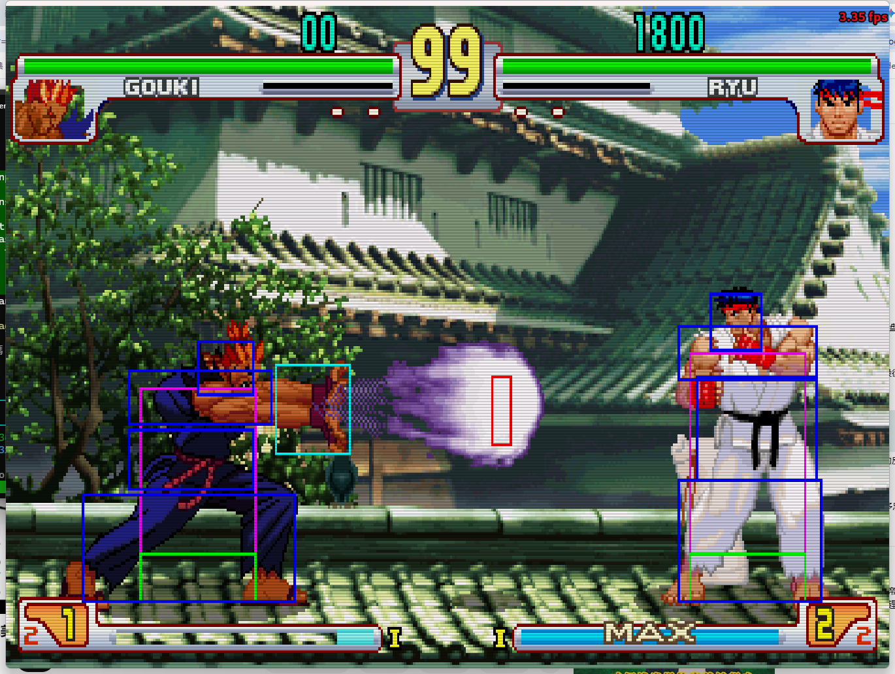
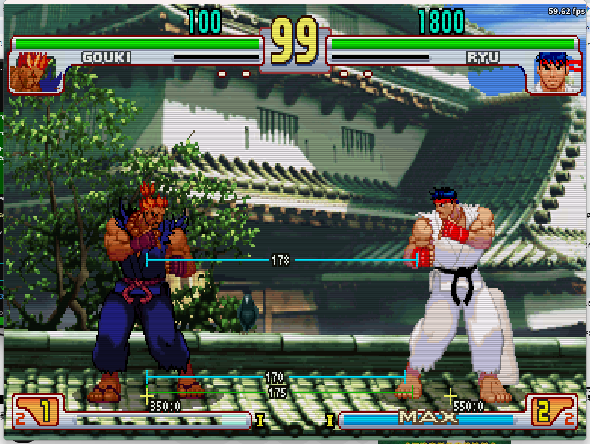

# Display

Toggle various on-screen overlays to visualize game data in real time.

| Option | Description |
|--------|-------------|
| Display Controllers | Show a controller icon with live button states for both P1 and P2. |
| Display Gauges Numbers | Show numeric values for HP, stun, and Super meter for both players. Also enables the Life Loss Indicator (a red bracket showing lost HP above the health bar). |
| Display P1 Input History | Show a scrolling log of P1's recent inputs. |
| Dynamic P1 Input History | Auto-scroll P1's input log so the most recent input always appears at the top. When enabled, Display P2 Input History is grayed out. |
| Display P2 Input History | Show a scrolling log of P2's recent inputs. Grayed out when Dynamic P1 Input History is on. |
| Display Damage Info | Show numeric damage values for each hit. |
| Display Frame Advantage | Show frame advantage or disadvantage after each hit or block. |
| Display Frame Table | Show the real-time per-frame state timeline for both players (startup / active / recovery / hitstun / parry / invincible). |
| Display Hitboxes | Show attack and hurt boxes with a color legend. |
| Display Distances | Show the distance between P1 and P2. Enables the three distance options below. |
| Mid Distance Height | Y-coordinate reference height used for mid-range distance calculation (0–200, default 10). |
| P1 distance reference point | Distance measurement origin for P1: character origin or hurtbox edge. |
| P2 distance reference point | Distance measurement origin for P2: character origin or hurtbox edge. |

---

## Display Gauges Numbers

When enabled, shows numeric HP / stun / Super values for both players, plus a **Life Loss Indicator** — a red ㄇ-shaped bracket above the health bar showing how much HP was lost in the current round.

---

## Display Damage Info

Shows per-hit damage, stun, and combo count in real time. Displays both current-hit values and running totals (Total Damage / Total Stun / Max Combo).

---

## Display P1 / P2 Input History

Shows a scrolling input log on screen — P1 on the left, P2 on the right. Each row shows a direction and the frame count it was held. Enable **Dynamic P1 Input History** to auto-scroll so the most recent input always appears at the top.

---

## Display Frame Advantage

After each hit or block, shows the move's **Startup**, **Active**, and **Duration** (total frames) on screen. Use this to quickly read frame data without leaving the game.

---

## Frame Table

The Frame Table shows a real-time per-frame state bar for both P1 (top) and P2 (bottom). Each colored block represents one game frame. The header line shows **Start / Total / Adv** stats after each move.

| Color | State | Meaning |
|-------|-------|---------|
| 🟩 Green | Startup | Frames before the first hitbox appears |
| 🟥 Red | Active | Frames where the attack hitbox is active |
| 🟫 Brown | Projectile | Frames where a projectile hitbox is active |
| 🟦 Blue | Recovery | Frames after the active window until the character can act |
| 🟨 Yellow | Hitstun / Blockstun | Frames the defender cannot act after being hit or blocking |
| 🟪 Purple | Parry | Frames where a parry succeeded |
| ⬜ White | Invincible | Frames where the character has no vulnerability box |
| ⬛ Dark grey | Neutral | Idle / no action |

---

## Display Hitboxes

| Color | Box type |
|-------|----------|
| 🟥 Red | Attack box (hitbox) |
| 🟦 Blue | Vulnerability box (hurtbox) |
| 🟩 Green | Extended vulnerability box |
| 🟨 Yellow | Throw box |
| 🟧 Orange | Throwable box (can be grabbed) |
| ⬜ White | Push box |

---

## Display Distances

Shows real-time distance measurements between P1 and P2 as horizontal lines on screen. Three measurements are displayed: ground distance (at feet), mid-body distance (configurable height), and a second reference line. Configure the height and reference point (character origin or hurtbox edge) for each player.
