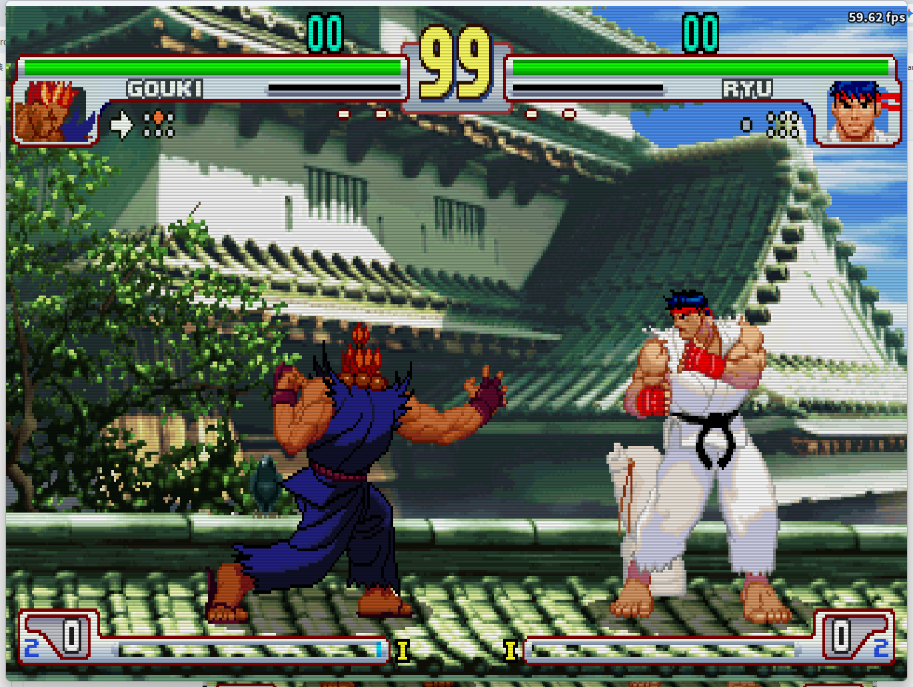
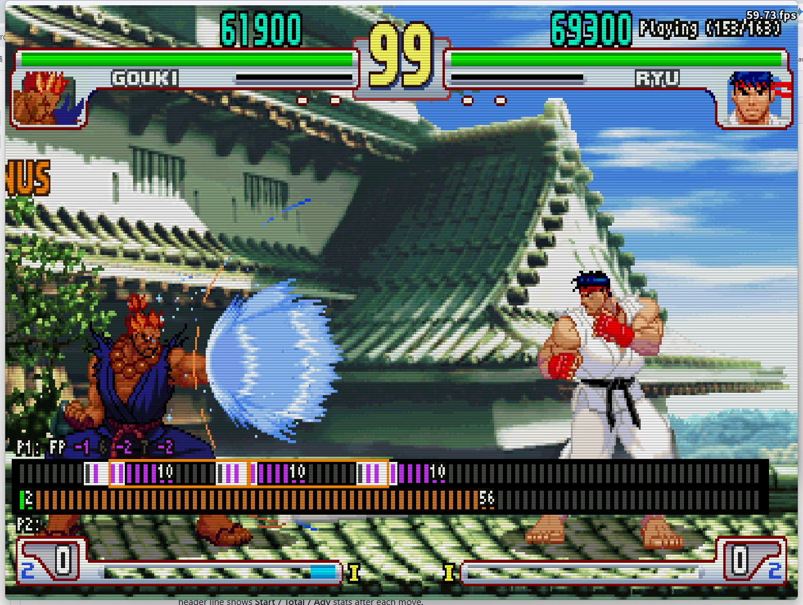

# Display

Toggle various on-screen overlays to visualize game data in real time.

| Option | Description |
|--------|-------------|
| Display Controllers | Show a controller icon with live button states for both P1 and P2. |
| Display Gauges Numbers | Show numeric values for HP, stun, and Super meter for both players. Also enables the Life Loss Indicator (a red bracket showing lost HP above the health bar). |
| Display P1 Input History | Show a scrolling log of P1's recent inputs. |
| Dynamic P1 Input History | Auto-scroll P1's input log so the most recent input always appears at the top. When enabled, Display P2 Input History is grayed out. |
| Display P2 Input History | Show a scrolling log of P2's recent inputs. Grayed out when Dynamic P1 Input History is on. |
| Display Damage Info | Show numeric damage values for each hit. |
| Display Frame Advantage | Show frame advantage or disadvantage after each hit or block. |
| Display Frame Table | Show the real-time per-frame state timeline for both players (neutral / startup / movement / active / recovery / hitstun / blocked / projectile / parry / invincible). |
| Parry SA Only | Switch the Frame Table to Super Art parry practice, see below. Only available while Display Frame Table is on. |
| Display Hitboxes | Show attack and hurt boxes with a color legend. |
| Display Distances | Show the distance between P1 and P2. Enables the three distance options below. |
| Mid Distance Height | Y-coordinate reference height used for mid-range distance calculation (0–200, default 10). |
| P1 distance reference point | Distance measurement origin for P1: character origin or hurtbox edge. |
| P2 distance reference point | Distance measurement origin for P2: character origin or hurtbox edge. |

---

## Display Controllers

Shows a controller icon with live button states above each player's health bar.

---

## Display Gauges Numbers

When enabled, shows numeric HP / stun / Super values for both players, plus a **Life Loss Indicator** — a red ㄇ-shaped bracket above the health bar showing how much HP was lost in the current round.

---

## Display Damage Info

Shows per-hit damage, stun, and combo count in real time. Displays both current-hit values and running totals (Total Damage / Total Stun / Max Combo).

---

## Display P1 / P2 Input History

Shows a scrolling input log on screen — P1 on the left, P2 on the right. Each row shows a direction and the frame count it was held. Enable **Dynamic P1 Input History** to auto-scroll so the most recent input always appears at the top.

---

## Display Frame Advantage

After each hit or block, shows the move's **Startup**, **Active**, and **Duration** (total frames) on screen. Use this to quickly read frame data without leaving the game.

---

## Frame Table

The Frame Table shows a real-time per-frame state bar for both P1 (top) and P2 (bottom). Each colored block represents one game frame. The header line shows **Start / Total / Adv** stats after each move.

| Color | State | Meaning |
|-------|-------|---------|
| ⬛ Dark grey | Neutral | Idle, no action |
| 🟩 Green | Startup | Frames before the first hitbox appears, including any airborne windup for jumping normals or specials |
| 🟢 Olive | Movement | Dash or jump with no hitbox yet, not idle but not a real attack windup either |
| 🟥 Red | Active | Frames where the attack hitbox is active |
| 🟦 Blue | Recovery | Frames after the active window until the character can act |
| 🟨 Yellow | Hitstun | Frames the defender cannot act after being hit, thrown, or knocked down |
| 🔵 Cyan | Blocked | Frames the defender is in blockstun after chip-blocking an attack, not parried |
| 🟫 Brown | Projectile | Frames where a projectile hitbox is active |
| 🟪 Purple | Parry | Frames where the parry input is being accepted, the validity window itself rather than only a successful parry, shown only while the opponent has an active hitbox or projectile |
| ⬜ White | Invincible | Frames where the character has no vulnerability box |

A white-bordered marker on the timeline is a successful parry, a yellow-bordered marker is a miss (early or late).

Below the timeline, a `P1: FP -2  17  -3 ...` style line lists each player's recent parry-gauge results. Each entry shows the parry type (`FP` forward, `DP` down, `AP` air) followed by its delta in frames, using the same convention as the Special Training parry gauges, where `+N` is N frames late and `-N` is N frames early. The plain number between two entries is the frame gap from the success frame of one result to the start of the next validity window, not necessarily when the input was pressed. When both entries are successful parries of the same type back to back (two white markers), this gap equals the attacker's real hit-to-hit interval, since a successful parry resolves on the exact frame it connects.

### Parry SA Only

Turn on **Parry SA Only** (right below Display Frame Table) to practice parrying Super Arts with the Frame Table.

- All parry validity windows use the same purple color, and the legend is reduced to 8 states
- The capture only arms on a real Super Art, so normal moves no longer start or reset it
- A Super Art capture stays continuous across the 90-frame boundary instead of being cut off
- A hollow box marks the range where the parry input was held
- An orange box marks the 17-frame rhythm target for the next forward tap
- The history line shows FP / DP / AP results, and the number between two entries is the gap from the success frame to the start of the next validity window

---

## Display Hitboxes

| Color | Box type |
|-------|----------|
| 🟥 Red | Attack box (hitbox) |
| 🟦 Blue | Vulnerability box (hurtbox) |
| 🟩 Green | Extended vulnerability box |
| 🟨 Yellow | Throw box |
| 🟧 Orange | Throwable box (can be grabbed) |
| ⬜ White | Push box |

---

## Display Distances

Shows real-time distance measurements between P1 and P2 as horizontal lines on screen. Three measurements are displayed: ground distance (at feet), mid-body distance (configurable height), and a second reference line. Configure the height and reference point (character origin or hurtbox edge) for each player.
