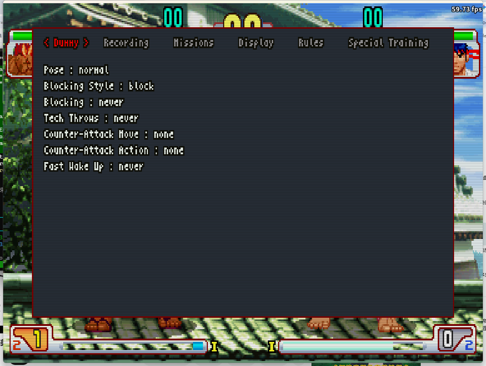

# Dummy

Configure how the CPU-controlled dummy behaves during training. Set its default stance, blocking style, throw tech responses, and counter-attack options.

| Option | Description |
|--------|-------------|
| Pose | Default stance for the dummy: Normal, Crouching, Forward Jump, Neutral Jump, Back Jump, Super Fwd Jump, Super Jump, Super Back Jump, Forward Dash, or Back Dash. |
| Blocking Style | How the dummy defends: block (normal guard), parry (forward parry), or red parry. Enables "Hits before Red Parry" when set to red parry. |
| Hits before Red Parry | Number of hits received before the dummy performs a red parry. Only active when Blocking Style is set to red parry. |
| Blocking | When the dummy triggers its blocking behavior: never, always, on combo hits only, or randomly. |
| Tech Throws | Whether the dummy attempts to escape throws: never, always, or randomly. |
| Counter-Attack Move | Stick motion for the dummy's counter-attack. Motions: QCF / QCB / HCF / HCB / DPF / DPB / HCharge / VCharge / 360 / DQCF / 720; directional: forward / back / down; jumps: jump / super jump / forward jump / forward super jump / back jump / back super jump / forward dash / back dash / guard jump; special: Shun Goku Satsu / Kongou Kokuretsu Zan. |
| Counter-Attack Action | Button the dummy presses for its counter-attack. Set to "recording" to replay a recorded slot instead. |
| Fast Wake Up | Whether the dummy quick-rises after a knockdown: never, always, or randomly. |
