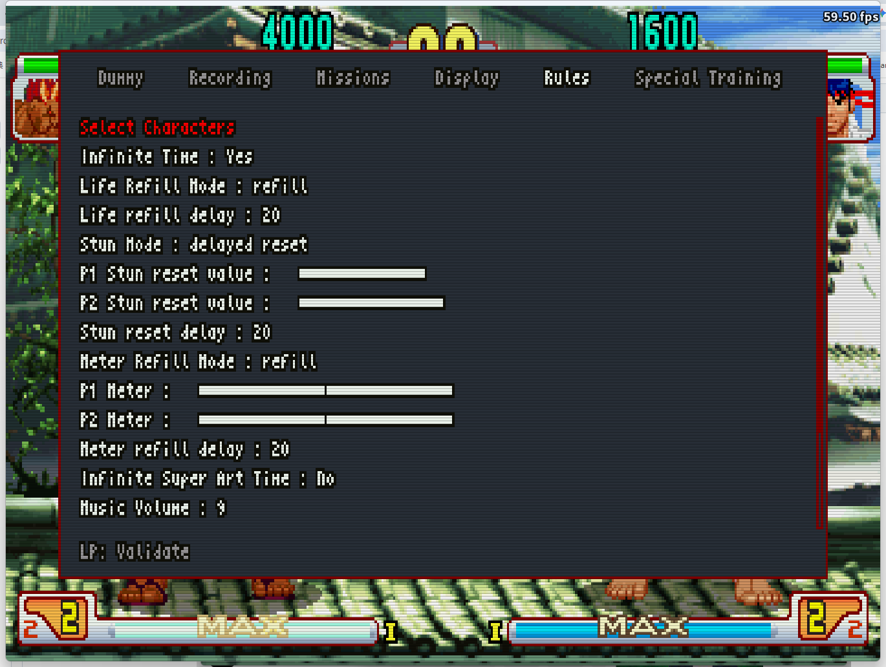

# Rules

Adjust match conditions to suit your training goals — time, health recovery, stun behavior, meter, and miscellaneous options.

| Option | Description |
|--------|-------------|
| Select Characters | Go to the character select screen to change characters. Only supported on the sfiii3nr1 ROM; not available on 4rd Strike. |
| Infinite Time | Prevent the round timer from counting down. |
| Life Refill Mode | HP recovery behavior: no refill (none), refill (recover to full after a delay), or infinite (never lose HP). |
| Life refill delay | Frames to wait after taking damage before HP starts recovering. Active when Life Refill Mode is set to refill (1–100, default 20). |
| Stun Mode | Stun bar behavior: normal, no stun (stun never builds), or delayed reset (stun resets to a set value after a delay). |
| P1 Stun reset value | Stun value P1 resets to after the delay. Active when Stun Mode is set to delayed reset (0–64). |
| P2 Stun reset value | Stun value P2 resets to after the delay. Active when Stun Mode is set to delayed reset (0–64). |
| Stun reset delay | Frames to wait after taking a hit before stun resets. Active when Stun Mode is set to delayed reset (1–100, default 20). |
| Meter Refill Mode | Super meter refill behavior: no refill, refill (recover to a set amount after a delay), or infinite. |
| P1 Meter | Target Super meter level for P1 when Meter Refill Mode is set to refill. |
| P2 Meter | Target Super meter level for P2 when Meter Refill Mode is set to refill. |
| Meter refill delay | Frames to wait before the Super meter refills. Active when Meter Refill Mode is set to refill (1–100, default 20). |
| Infinite Super Art Time | Super Art gauge does not drain after activation — the effect lasts indefinitely. |
| Music Volume | Background music volume (0–10, default 10). |
| Speed Up Game Intro | Skip or accelerate the game intro animation to reduce wait time. |
